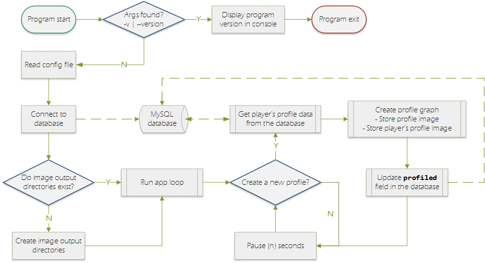
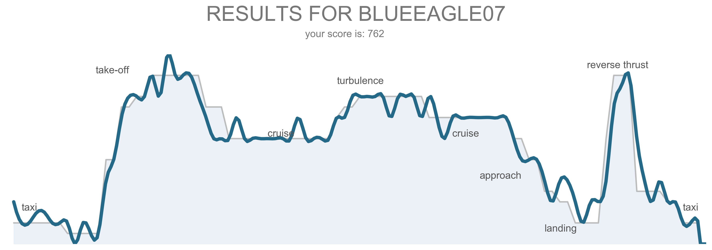

### Flight Simulation Game
---


# PROFILER
---
The profiler app creates a graph which is displayed on the scoreboard after a player has finished the game.  The graph shows the target profile overlaid with the player's actual profile.


## DESIGN
---
The profiler application is written in Python, and uses the `matplotlib.pyplot` package to create the profile image.

The graphs are stored in the scoreboard program's directory structure; therefore it is essential (on program deployment) the `dir_graph` and `dir_graph_player` [config keys](config.json) are updated with the path to the scoreboard's image directory.  

The player's individual profile graph is saved and can be made available to the player upon request.

The flow diagram below illustrates the program's design and logic.  




### EXAMPLE PROFILE GRAPH
Below is an example of the target vs. actual profile graph which is displayed by the scoreboard.  Notice the target 'flight' profile in light grey block, labeled with the different phases of flight.  The player's actual profile is drawn in the heavy blue line.




## START THE APP
---
Follow these steps to start the profiler app:

1) Start the program by entering these commands into the CLI:
```bash
> cd ~/<deployment_directory>/profiler/
> python profiler.py
```


**Note:** If using an SSH session to start the profiler, start the SSH sessions using `ssh -X`, to enable X11 forwarding. Otherwise matplotlib (via tkinter) will throw you a nice `DISPLAY` error as mentioned [here](https://stackoverflow.com/q/37604289/6340496 "stackoverflow post").  We will address this issue in an upcoming version.
