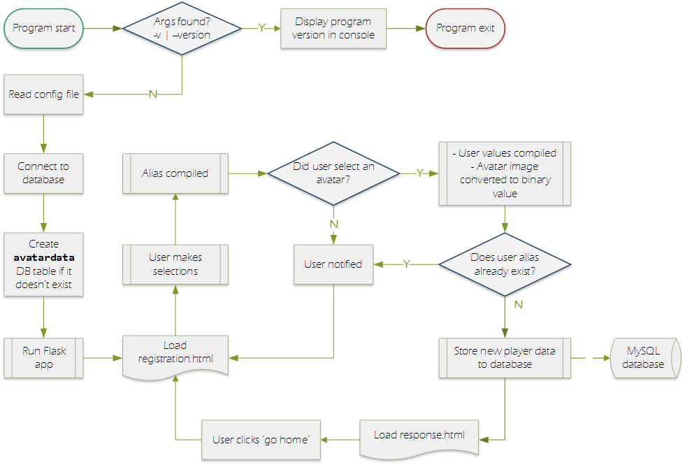
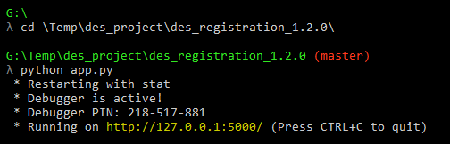

### Flight Simulation Game
---


# PLAYER REGISTRATION
---
This app is the service used to run the player registration web UI for the Flight Simulation Game.


## DESIGN
---
The registration application itself is programmed in Python, with the `Flask` package serving the UI content.  Both the registration and response pages are coded in HTML/CSS with a little bit of Javascript.

Once the new player clicks `Register!`, the player's selections and avatar image are stored to the `avatardata` table of the MySQL database.

The flow diagram below illustrates the program's design and logic.




## START THE APP
---
Follow the steps below to start the registration interface:

1) Start the program by entering these commands into the CLI:
```bash
> cd ~/<deployment_directory>/registration/
> python app.py
```

When the program starts, observe the host IP and port number <span style="background-color: black; color: yellow;"> &nbsp; highlighted in yellow&nbsp; </span>, as these will be used in the browser to view the registration page.



2) Open your internet browser - Firefox by design
   + In the address bar, enter the IP and port number as observed in the step above

3) <span style="color: #777;">OPTIONAL:</span> run your browser in full-screen mode by pressing `F11`


## USE FROM A PORTABLE DEVICE (optional)
---
The registration app is designed to be run form a web browser on the local PC.  However with a couple config changes the app can be run from a portable device like a tablet or your phone!

### CONFIG UPDATES
Using `config.json`, update the following keys as shown below:

   + `site`: "http://192.168.xxx.xxx:5000"
   + `host`: "0.0.0.0"
   + `port`: 5000
   
The `site` key is used for file path string replacement when loading the player's avatar image into the database.  This key must be the **local IP of the PC running the app, and the port number being used.**  
The `host` key is set to 0.0.0.0, making the site 'public'.  
The `port` key is the port used, and **must match the port used in the `site` string.**

### USE
On your portable device, simply open a browser app and type the IP and port into the address bar.  For example: http://192.168.0.62:5000.  Done!

#### TROUBLESHOOTING
If the registration site does not load, it *might* be a firewall setting on the PC running the app.

**LINUX**  
If running the app on Linux, you can use the following command to punch a hole in the firewall to allow the portable device to access the app, and thus load the site.

```bash
> iptables -I INPUT -p tcp --dport 5000 -j ACCEPT
```

   + `-I` stands for **insert**, which inserts a new rule at the top of the `iptables` chain.  `INPUT` tells `iptables` which chain you want the rule added to
   + `-p tcp` tells the rule to match only packets using the TCP protocol
   + `--dport 5000` says to match traffic headed for port 5000.  **This port must match the port used in the config file!**
   + `-j ACCEPT` jumps to the ACCEPT action, to allow the traffic through
